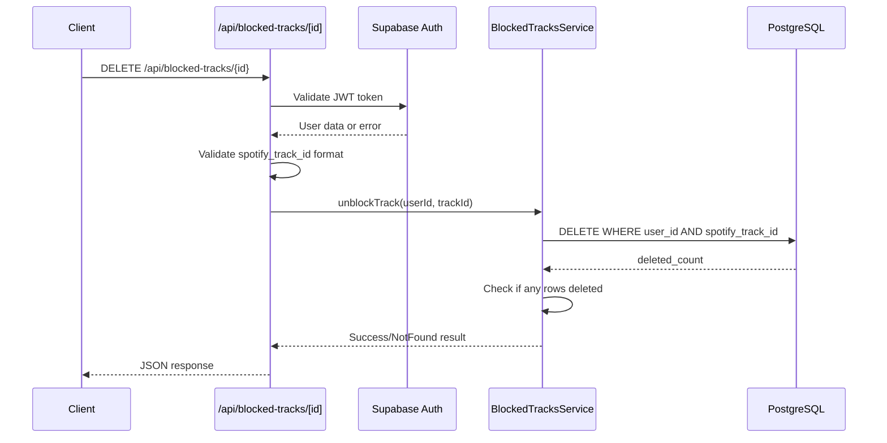

# API Endpoint Implementation Plan: DELETE /api/blocked-tracks/{spotify_track_id}

## 1. Przegląd punktu końcowego

Endpoint DELETE /api/blocked-tracks/{spotify_track_id} służy do usuwania blokady utworu (unblocking). Implementuje funkcjonalność zarządzania blokadami pozwalającą użytkownikom na przywracanie utworów do puli potencjalnych rekomendacji.

**Kluczowe założenia:**

- Użytkownik musi być uwierzytelniony przez Supabase Auth
- Każdy użytkownik może usuwać tylko swoje blokady (RLS)
- Operacja jest idempotentna - wielokrotne wywołanie nie powoduje błędu
- Usuwanie dotyczy zarówno blokad czasowych jak i permanentnych
- Automatyczne czyszczenie wygasłych blokad działa niezależnie

## 2. Szczegóły żądania

- **Metoda HTTP:** DELETE
- **Struktura URL:** `/api/blocked-tracks/{spotify_track_id}`
- **Parametry:**
  - **Wymagane:**
    - `spotify_track_id` (parametr ścieżki) - identyfikator utworu Spotify, dokładnie 22 znaki alfanumeryczne
  - **Opcjonalne:** Brak
- **Request Body:** Brak (DELETE z parametrem w URL)
- **Headers wymagane:**
  - `Authorization: Bearer <jwt_token>` - token Supabase Auth

## 3. Wykorzystywane typy

```typescript
// Import z types.ts
import type { SuccessMessageDTO, ErrorResponseDTO, SpotifyTrackId, BlockedTrackEntity } from "../types";

// Funkcje utility
import { createSpotifyTrackId } from "../types";
```

**Główne typy w implementacji:**

- `SuccessMessageDTO` - standardowa odpowiedź sukcesu z komunikatem
- `ErrorResponseDTO` - standardowa struktura błędów
- `SpotifyTrackId` - branded type dla walidacji ID Spotify
- `BlockedTrackEntity` - typ encji z bazy danych

## 4. Szczegóły odpowiedzi

### Sukces (200 OK)

```json
{
  "message": "Track unblocked successfully"
}
```

### Błędy

- **400 Bad Request:**

  ```json
  {
    "error": "Bad Request",
    "message": "Invalid spotify_track_id format",
    "status": 400
  }
  ```

- **401 Unauthorized:**

  ```json
  {
    "error": "Unauthorized",
    "message": "Invalid or missing authentication",
    "status": 401
  }
  ```

- **404 Not Found:**

  ```json
  {
    "error": "Not Found",
    "message": "Track not blocked by user",
    "status": 404
  }
  ```

- **500 Internal Server Error:**
  ```json
  {
    "error": "Internal Server Error",
    "message": "An unexpected error occurred",
    "status": 500
  }
  ```

## 5. Przepływ danych



**Kluczowe kroki:**

1. Walidacja i dekodowanie JWT tokena (middleware)
2. Walidacja formatu `spotify_track_id`
3. Wywołanie service do usunięcia blokady
4. Wykonanie operacji DELETE z RLS
5. Sprawdzenie czy jakiś wiersz został usunięty
6. Zwrócenie odpowiedniego komunikatu (success/not found)

## 6. Względy bezpieczeństwa

### Autentykacja i autoryzacja

- **JWT Validation:** Middleware sprawdza poprawność tokena Supabase
- **Row Level Security:** Automatyczne filtrowanie po `auth.uid()` w bazie
- **User Isolation:** Użytkownik może usuwać tylko swoje blokady

### Walidacja danych

- **Input Sanitization:** Walidacja formatu `spotify_track_id` przed zapytaniem DB
- **SQL Injection Prevention:** Parametryzowane zapytania Supabase
- **Path Parameter Validation:** Sprawdzenie długości i formatu ID

### Rate Limiting

- Implementacja na poziomie middleware: 1000 req/h per user
- Monitoring nadużyć przy multiple DELETE requests

## 7. Obsługa błędów

### Scenariusze błędów i odpowiedzi

| Scenariusz              | Status | Komunikat                         | Logowanie |
| ----------------------- | ------ | --------------------------------- | --------- |
| Brak JWT tokena         | 401    | "Missing authorization header"    | Warning   |
| Nieprawidłowy JWT       | 401    | "Invalid authentication token"    | Warning   |
| Nieprawidłowy format ID | 400    | "Invalid spotify_track_id format" | Info      |
| Blokada nie istnieje    | 404    | "Track not blocked by user"       | Info      |
| Błąd bazy danych        | 500    | "An unexpected error occurred"    | Error     |
| Rate limit exceeded     | 429    | "Too many requests"               | Warning   |

### Strategia error handling

- **Early Returns:** Walidacja na początku funkcji
- **Guard Clauses:** Sprawdzanie warunków przed operacjami
- **Consistent Responses:** Jednolity format błędów
- **Proper Logging:** Różne poziomy logowania w zależności od typu błędu
- **Idempotent Behavior:** 404 dla nieistniejących blokad, nie 200

## 8. Rozważania dotyczące wydajności

### Potencjalne wąskie gardła

- **RLS Overhead:** Dodatkowe sprawdzenia Row Level Security
- **JWT Parsing:** Overhead dekodowania tokena przy każdym request
- **Index Lookups:** Wyszukiwanie po złożonym kluczu (user_id, spotify_track_id)

### Strategie optymalizacji

- **Index Usage:** Wykorzystanie `idx_blocked_tracks_user_spotify`
- **Single Query Operation:** DELETE bezpośrednio, bez wcześniejszego SELECT
- **Connection Pooling:** Supabase connection pooling
- **Efficient WHERE Clause:** Wykorzystanie composite index

### Query Optimization

```sql
-- Optymalne zapytanie z wykorzystaniem indeksu
DELETE FROM blocked_tracks
WHERE user_id = $1 AND spotify_track_id = $2
RETURNING id; -- Do sprawdzenia czy coś zostało usunięte
```

### Monitoring

- Czas odpowiedzi endpoint'u
- Stosunek 404 do 200 responses (może wskazywać na problemy UX)
- Wykorzystanie indeksów
- Performance metrics dla DELETE operations

## 9. Etapy wdrożenia

### 1. Rozszerzenie BlockedTracksService

```typescript
// src/lib/services/blocked-tracks.service.ts
export async function unblockTrack(
  supabase: SupabaseClient,
  userId: string,
  spotifyTrackId: SpotifyTrackId
): Promise<void>;
```

### 2. Implementacja endpoint handler

```typescript
// src/pages/api/blocked-tracks/[spotify_track_id].ts
export const DELETE = async (context: APIContext) => {
  // Implementation
};
```

### 3. Walidacja input parameters

- Implementacja walidacji `spotify_track_id`
- Path parameter extraction i sanitization
- Early return dla invalid inputs

### 4. Business Logic

- Implementacja DELETE operation z RLS
- Proper handling gdy blokada nie istnieje
- Idempotent behavior

### 5. Testowanie jednostkowe

- Test Cases dla różnych scenariuszy
- Test edge cases (nieistniejąca blokada, nieprawidłowy ID)
- Mock'owanie Supabase responses
- Test idempotent behavior

### 6. Testowanie integracyjne

- E2E test flow'u usuwania blokady
- Test autentykacji i autoryzacji
- Test performance z różnymi rozmiarami baz blokad
- Test concurrent operations

### 7. Error Handling i Response Formatting

- Implementacja standardowych error responses
- Proper HTTP status codes
- Consistent message formatting

### 8. Dokumentacja

- Aktualizacja API documentation
- Przykłady usage scenarios
- Error handling guidelines

### 9. Deployment i monitoring

- Deploy na środowisko testowe
- Konfiguracja monitoringu błędów
- Rate limiting configuration
- Performance baseline establishment
- Production deployment

**Szacowany czas implementacji:** 1-2 dni dla pojedynczego developera
**Priorytet:** Średni (ważna funkcjonalność, ale mniej krytyczna od dodawania blokad)
