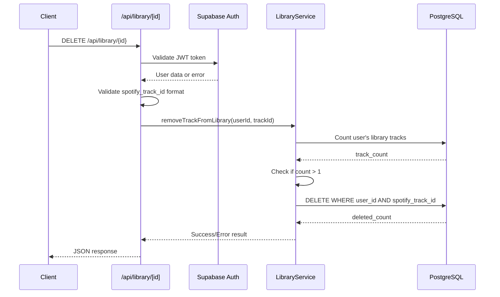

# API Endpoint Implementation Plan: DELETE /api/library/{spotify_track_id}

## 1. Przegląd punktu końcowego

Endpoint DELETE /api/library/{spotify_track_id} służy do usuwania utworu z biblioteki muzycznej użytkownika. Implementuje kluczową funkcjonalność zarządzania biblioteką z dodatkową regułą biznesową zapobiegającą usunięciu ostatniego utworu z biblioteki użytkownika.

**Kluczowe założenia:**

- Użytkownik musi być uwierzytelniony przez Supabase Auth
- Nie można usunąć ostatniego utworu z biblioteki (min. 1 utwór)
- Każdy użytkownik może modyfikować tylko swoją bibliotekę (RLS)
- Operacja jest idempotentna - wielokrotne wywołanie nie powoduje błędu

## 2. Szczegóły żądania

- **Metoda HTTP:** DELETE
- **Struktura URL:** `/api/library/{spotify_track_id}`
- **Parametry:**
  - **Wymagane:**
    - `spotify_track_id` (parametr ścieżki) - identyfikator utworu Spotify, dokładnie 22 znaki alfanumeryczne
  - **Opcjonalne:** Brak
- **Request Body:** Brak (DELETE z parametrem w URL)
- **Headers wymagane:**
  - `Authorization: Bearer <jwt_token>` - token Supabase Auth

## 3. Wykorzystywane typy

```typescript
// Import z types.ts
import type { SuccessMessageDTO, ErrorResponseDTO, SpotifyTrackId, UserLibraryEntity } from "../types";

// Funkcje utility
import { createSpotifyTrackId } from "../types";
```

**Główne typy w implementacji:**

- `SuccessMessageDTO` - standardowa odpowiedź sukcesu z komunikatem
- `ErrorResponseDTO` - standardowa struktura błędów
- `SpotifyTrackId` - branded type dla walidacji ID Spotify
- `UserLibraryEntity` - typ encji z bazy danych

## 4. Szczegóły odpowiedzi

### Sukces (200 OK)

```json
{
  "message": "Track removed from library successfully"
}
```

### Błędy

- **400 Bad Request:**

  ```json
  {
    "error": "Bad Request",
    "message": "Cannot remove last track from library" | "Invalid spotify_track_id format",
    "status": 400
  }
  ```

- **401 Unauthorized:**

  ```json
  {
    "error": "Unauthorized",
    "message": "Invalid or missing authentication",
    "status": 401
  }
  ```

- **404 Not Found:**

  ```json
  {
    "error": "Not Found",
    "message": "Track not found in user's library",
    "status": 404
  }
  ```

- **500 Internal Server Error:**
  ```json
  {
    "error": "Internal Server Error",
    "message": "An unexpected error occurred",
    "status": 500
  }
  ```

## 5. Przepływ danych



**Kluczowe kroki:**

1. Walidacja i dekodowanie JWT tokena (middleware)
2. Walidacja formatu `spotify_track_id`
3. Sprawdzenie liczby utworów w bibliotece użytkownika
4. Walidacja reguły biznesowej (min. 1 utwór)
5. Wykonanie operacji DELETE z RLS
6. Zwrócenie odpowiedniego komunikatu

## 6. Względy bezpieczeństwa

### Autentykacja i autoryzacja

- **JWT Validation:** Middleware sprawdza poprawność tokena Supabase
- **Row Level Security:** Automatyczne filtrowanie po `auth.uid()` w bazie
- **User Isolation:** Użytkownik może usuwać tylko ze swojej biblioteki

### Walidacja danych

- **Input Sanitization:** Walidacja formatu `spotify_track_id` przed zapytaniem DB
- **Business Rules:** Kontrola minimalnej liczby utworów w bibliotece
- **SQL Injection Prevention:** Parametryzowane zapytania Supabase

### Rate Limiting

- Implementacja na poziomie middleware: 1000 req/h per user
- Monitoring nadużyć przy multiple DELETE requests

## 7. Obsługa błędów

### Scenariusze błędów i odpowiedzi

| Scenariusz                 | Status | Komunikat                               | Logowanie |
| -------------------------- | ------ | --------------------------------------- | --------- |
| Brak JWT tokena            | 401    | "Missing authorization header"          | Warning   |
| Nieprawidłowy JWT          | 401    | "Invalid authentication token"          | Warning   |
| Nieprawidłowy format ID    | 400    | "Invalid spotify_track_id format"       | Info      |
| Ostatni utwór w bibliotece | 400    | "Cannot remove last track from library" | Info      |
| Utwór nie istnieje         | 404    | "Track not found in user's library"     | Info      |
| Błąd bazy danych           | 500    | "An unexpected error occurred"          | Error     |
| Rate limit exceeded        | 429    | "Too many requests"                     | Warning   |

### Strategia error handling

- **Early Returns:** Walidacja na początku funkcji
- **Guard Clauses:** Sprawdzanie warunków przed operacjami
- **Consistent Responses:** Jednolity format błędów
- **Proper Logging:** Różne poziomy logowania w zależności od typu błędu

## 8. Rozważania dotyczące wydajności

### Potencjalne wąskie gardła

- **Database Query Count:** Zapytanie o liczbę + DELETE (2 queries)
- **RLS Overhead:** Dodatkowe sprawdzenia Row Level Security
- **JWT Parsing:** Overhead dekodowania tokena przy każdym request

### Strategie optymalizacji

- **Transaction Usage:** Operacje w pojedynczej transakcji
- **Index Optimization:** Wykorzystanie istniejących indeksów (`user_id`, `spotify_track_id`)
- **Connection Pooling:** Supabase connection pooling
- **Caching:** Możliwość cache'owania liczby utworów użytkownika

### Monitoring

- Czas odpowiedzi endpoint'u
- Liczba błędów 400 (próby usunięcia ostatniego utworu)
- Rate limiting statistics

## 9. Etapy wdrożenia

### 1. Rozszerzenie LibraryService

```typescript
// src/lib/services/library.service.ts
export async function removeTrackFromLibrary(
  supabase: SupabaseClient,
  userId: string,
  spotifyTrackId: SpotifyTrackId
): Promise<void>;
```

### 2. Implementacja endpoint handler

```typescript
// src/pages/api/library/[spotify_track_id].ts
export const DELETE = async (context: APIContext) => {
  // Implementation
};
```

### 3. Walidacja i error handling

- Implementacja walidacji `spotify_track_id`
- Sprawdzenie reguły biznesowej (min. 1 utwór)
- Standardowe error responses

### 4. Testowanie jednostkowe

- Test Cases dla wszystkich scenariuszy błędów
- Test reguły biznesowej (ostatni utwór)
- Mock'owanie Supabase responses

### 5. Testowanie integracyjne

- E2E test flow'u usuwania utworu
- Test autentykacji i autoryzacji
- Test wydajności z większymi bibliotekami

### 6. Dokumentacja

- Aktualizacja API documentation
- Przykłady użycia w README
- Error handling guidelines

### 7. Deployment i monitoring

- Deploy na środowisko testowe
- Konfiguracja monitoringu błędów
- Rate limiting configuration
- Production deployment

**Szacowany czas implementacji:** 2-3 dni dla pojedynczego developera
**Priorytet:** Wysoki (kluczowa funkcjonalność zarządzania biblioteką)
