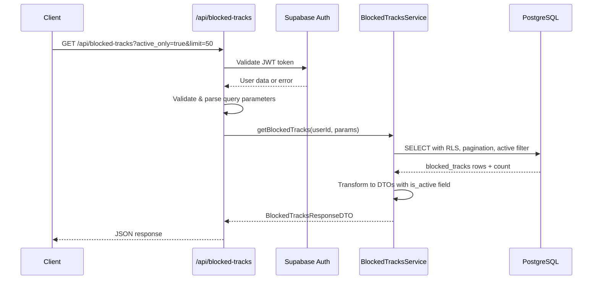

# API Endpoint Implementation Plan: GET /api/blocked-tracks

## 1. Przegląd punktu końcowego

Endpoint GET /api/blocked-tracks służy do pobierania listy utworów zablokowanych przez użytkownika. Implementuje funkcjonalność zarządzania blokadami utworów z opcjonalnym filtrowaniem tylko aktywnych blokad (niewygasłych) oraz paginacją wyników.

**Kluczowe założenia:**

- Użytkownik musi być uwierzytelniony przez Supabase Auth
- Domyślnie zwraca tylko aktywne blokady (niewygasłe)
- Wspiera paginację z limitem max 100 elementów
- Każdy użytkownik widzi tylko swoje blokady (RLS)
- Blokady wygasłe są automatycznie czyszczone przez trigger

## 2. Szczegóły żądania

- **Metoda HTTP:** GET
- **Struktura URL:** `/api/blocked-tracks`
- **Parametry:**
  - **Opcjonalne:**
    - `active_only` (boolean, default: true) - Tylko niewygasłe blokady
    - `limit` (number, default: 50, max: 100) - Liczba zwracanych elementów
    - `offset` (number, default: 0) - Offset dla paginacji
  - **Wymagane:** Brak
- **Request Body:** Brak (GET request)
- **Headers wymagane:**
  - `Authorization: Bearer <jwt_token>` - token Supabase Auth

## 3. Wykorzystywane typy

```typescript
// Import z types.ts
import type {
  BlockedTracksResponseDTO,
  BlockedTracksQueryParams,
  BlockedTrackDTO,
  ErrorResponseDTO,
  BlockedTrackEntity,
} from "../types";
```

**Główne typy w implementacji:**

- `BlockedTracksQueryParams` - parametry zapytania z walidacją
- `BlockedTracksResponseDTO` - struktura odpowiedzi z paginacją
- `BlockedTrackDTO` - pojedynczy zablokowany utwór z computed `is_active` field
- `BlockedTrackEntity` - typ encji z bazy danych

## 4. Szczegóły odpowiedzi

### Sukces (200 OK)

```json
{
  "blocked_tracks": [
    {
      "spotify_track_id": "4iV5W9uYEdYUVa79Axb7Rh",
      "expires_at": "2024-01-08T12:00:00Z",
      "created_at": "2024-01-01T12:00:00Z",
      "is_active": true
    },
    {
      "spotify_track_id": "7qiZfU4dY4WlSIo1C6HGvV",
      "expires_at": null,
      "created_at": "2024-01-02T12:00:00Z",
      "is_active": true
    }
  ],
  "total_count": 15
}
```

### Błędy

- **401 Unauthorized:**

  ```json
  {
    "error": "Unauthorized",
    "message": "Invalid or missing authentication",
    "status": 401
  }
  ```

- **400 Bad Request:**

  ```json
  {
    "error": "Bad Request",
    "message": "Invalid query parameters",
    "status": 400
  }
  ```

- **500 Internal Server Error:**
  ```json
  {
    "error": "Internal Server Error",
    "message": "An unexpected error occurred",
    "status": 500
  }
  ```

## 5. Przepływ danych



**Kluczowe kroki:**

1. Walidacja i dekodowanie JWT tokena (middleware)
2. Walidacja i parsing parametrów zapytania
3. Wywołanie service z parametrami
4. Zapytanie do bazy z filtrowaniem i paginacją
5. Transformacja entity do DTO z computed fields
6. Zwrócenie odpowiedzi z metadanymi paginacji

## 6. Względy bezpieczeństwa

### Autentykacja i autoryzacja

- **JWT Validation:** Middleware sprawdza poprawność tokena Supabase
- **Row Level Security:** Automatyczne filtrowanie po `auth.uid()` w bazie
- **User Isolation:** Użytkownik widzi tylko swoje blokady

### Walidacja danych

- **Query Parameters Validation:** Sprawdzenie zakresów limit (1-100)
- **Type Safety:** Walidacja typów boolean dla `active_only`
- **SQL Injection Prevention:** Parametryzowane zapytania Supabase

### Rate Limiting

- Implementacja na poziomie middleware: 1000 req/h per user
- Monitoring nadużyć przy częstych zapytaniach

## 7. Obsługa błędów

### Scenariusze błędów i odpowiedzi

| Scenariusz                 | Status | Komunikat                      | Logowanie |
| -------------------------- | ------ | ------------------------------ | --------- |
| Brak JWT tokena            | 401    | "Missing authorization header" | Warning   |
| Nieprawidłowy JWT          | 401    | "Invalid authentication token" | Warning   |
| Nieprawidłowy limit (>100) | 400    | "Limit cannot exceed 100"      | Info      |
| Nieprawidłowy offset (<0)  | 400    | "Offset must be non-negative"  | Info      |
| Nieprawidłowy active_only  | 400    | "active_only must be boolean"  | Info      |
| Błąd bazy danych           | 500    | "An unexpected error occurred" | Error     |
| Rate limit exceeded        | 429    | "Too many requests"            | Warning   |

### Strategia error handling

- **Early Returns:** Walidacja parametrów na początku
- **Guard Clauses:** Sprawdzanie warunków przed operacjami DB
- **Consistent Responses:** Jednolity format błędów
- **Proper Logging:** Różne poziomy logowania w zależności od typu błędu

## 8. Rozważania dotyczące wydajności

### Potencjalne wąskie gardła

- **Database Query Performance:** Filtrowanie po `expires_at` z NULL checks
- **RLS Overhead:** Dodatkowe sprawdzenia Row Level Security
- **Large Result Sets:** Duże biblioteki blokad użytkowników

### Strategie optymalizacji

- **Index Usage:** Wykorzystanie `idx_blocked_tracks_user_id` i `idx_blocked_tracks_expires_at`
- **Efficient Pagination:** LIMIT/OFFSET z COUNT optimization
- **Active Filter Optimization:** Indeks na `expires_at` dla szybkich filtrów
- **Connection Pooling:** Supabase connection pooling

### Query Optimization

```sql
-- Zoptymalizowane zapytanie dla active_only=true
SELECT spotify_track_id, expires_at, created_at,
       (expires_at IS NULL OR expires_at > NOW()) as is_active
FROM blocked_tracks
WHERE user_id = $1
  AND (expires_at IS NULL OR expires_at > NOW())
ORDER BY created_at DESC
LIMIT $2 OFFSET $3;
```

### Monitoring

- Czas odpowiedzi endpoint'u
- Wykorzystanie indeksów
- Rozmiar result sets
- Cache hit rates (jeśli implementowane)

## 9. Etapy wdrożenia

### 1. Stworzenie BlockedTracksService

```typescript
// src/lib/services/blocked-tracks.service.ts
export async function getBlockedTracks(
  supabase: SupabaseClient,
  userId: string,
  params: BlockedTracksQueryParams
): Promise<BlockedTracksResponseDTO>;
```

### 2. Implementacja endpoint handler

```typescript
// src/pages/api/blocked-tracks.ts
export const GET = async (context: APIContext) => {
  // Implementation
};
```

### 3. Walidacja parametrów zapytania

- Implementacja walidacji dla `limit`, `offset`, `active_only`
- Parsowanie i sanitizacja query parameters
- Default values handling

### 4. Logika biznesowa

- Implementacja filtrowania aktywnych blokad
- Paginacja z total_count
- Transformacja entity → DTO z computed fields

### 5. Testowanie jednostkowe

- Test Cases dla różnych kombinacji parametrów
- Test paginacji i edge cases
- Mock'owanie Supabase responses
- Test computed `is_active` field

### 6. Testowanie integracyjne

- E2E test flow'u pobierania blokad
- Test autentykacji i autoryzacji
- Test wydajności z dużymi zbiorami danych
- Test edge cases (brak blokad, wszystkie wygasłe)

### 7. Optymalizacja

- Analiza execution plans
- Index optimization jeśli potrzebne
- Caching strategy (opcjonalne)

### 8. Dokumentacja

- Aktualizacja API documentation
- Przykłady użycia z różnymi parametrami
- Performance considerations

### 9. Deployment i monitoring

- Deploy na środowisko testowe
- Konfiguracja monitoringu wydajności
- Rate limiting configuration
- Production deployment

**Szacowany czas implementacji:** 1-2 dni dla pojedynczego developera
**Priorytet:** Średni (funkcjonalność odczytu, mniej krytyczna od zarządzania)
