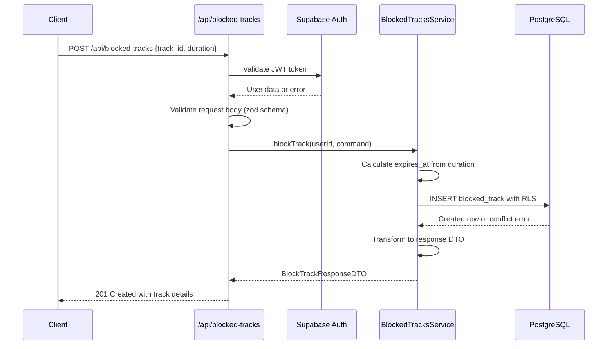

# API Endpoint Implementation Plan: POST /api/blocked-tracks

## 1. Przegląd punktu końcowego

Endpoint POST /api/blocked-tracks służy do blokowania utworu przed rekomendacjami. Implementuje kluczową funkcjonalność zarządzania blokadami z różnymi okresami trwania (1d, 7d, permanent) oraz automatycznym wyliczaniem daty wygaśnięcia.

**Kluczowe założenia:**

- Użytkownik musi być uwierzytelniony przez Supabase Auth
- Wspiera trzy typy blokad: 1d, 7d, permanent
- Automatyczne wyliczanie `expires_at` na podstawie `duration`
- Każdy użytkownik może blokować tylko w swojej przestrzeni (RLS)
- Unikalne blokady - nie można zablokować tego samego utworu dwukrotnie
- Zwraca szczegóły utworzonej blokady w odpowiedzi

## 2. Szczegóły żądania

- **Metoda HTTP:** POST
- **Struktura URL:** `/api/blocked-tracks`
- **Parametry:**
  - **Wymagane:** Brak (dane w body)
  - **Opcjonalne:** Brak
- **Request Body:**
  ```json
  {
    "spotify_track_id": "4iV5W9uYEdYUVa79Axb7Rh",
    "duration": "7d"
  }
  ```
- **Headers wymagane:**
  - `Authorization: Bearer <jwt_token>` - token Supabase Auth
  - `Content-Type: application/json`

## 3. Wykorzystywane typy

```typescript
// Import z types.ts
import type {
  BlockTrackCommand,
  BlockTrackResponseDTO,
  BlockDuration,
  ErrorResponseDTO,
  ValidationErrorResponseDTO,
  BlockedTrackInsert,
  SpotifyTrackId,
} from "../types";

// Funkcje utility
import { createSpotifyTrackId } from "../types";
```

**Główne typy w implementacji:**

- `BlockTrackCommand` - struktura request body z walidacją
- `BlockTrackResponseDTO` - odpowiedź z szczegółami blokady
- `BlockDuration` - enum dla typów blokad ("1d" | "7d" | "permanent")
- `BlockedTrackInsert` - typ dla INSERT do bazy danych

## 4. Szczegóły odpowiedzi

### Sukces (201 Created)

```json
{
  "spotify_track_id": "4iV5W9uYEdYUVa79Axb7Rh",
  "expires_at": "2024-01-08T12:00:00Z",
  "created_at": "2024-01-01T12:00:00Z",
  "duration": "7d"
}
```

### Błędy

- **400 Bad Request:**

  ```json
  {
    "error": "Bad Request",
    "message": "Invalid spotify_track_id format",
    "status": 400
  }
  ```

- **401 Unauthorized:**

  ```json
  {
    "error": "Unauthorized",
    "message": "Invalid or missing authentication",
    "status": 401
  }
  ```

- **409 Conflict:**

  ```json
  {
    "error": "Conflict",
    "message": "Track already blocked",
    "status": 409
  }
  ```

- **422 Unprocessable Entity:**

  ```json
  {
    "error": "Validation Error",
    "message": "Request validation failed",
    "status": 422,
    "errors": [
      {
        "field": "duration",
        "message": "Duration must be one of: 1d, 7d, permanent"
      }
    ]
  }
  ```

- **500 Internal Server Error:**
  ```json
  {
    "error": "Internal Server Error",
    "message": "An unexpected error occurred",
    "status": 500
  }
  ```

## 5. Przepływ danych



**Kluczowe kroki:**

1. Walidacja i dekodowanie JWT tokena (middleware)
2. Walidacja request body przez zod schema
3. Wyliczenie `expires_at` na podstawie `duration`
4. Próba INSERT do bazy z handling konfliktów
5. Transformacja entity do response DTO
6. Zwrócenie szczegółów utworzonej blokady

## 6. Względy bezpieczeństwa

### Autentykacja i autoryzacja

- **JWT Validation:** Middleware sprawdza poprawność tokena Supabase
- **Row Level Security:** Automatyczne ustawienie `user_id` z `auth.uid()`
- **User Isolation:** Użytkownik może blokować tylko w swojej przestrzeni

### Walidacja danych

- **Input Sanitization:** Walidacja formatu `spotify_track_id` (22 znaki)
- **Business Rules:** Walidacja `duration` enum values
- **SQL Injection Prevention:** Parametryzowane zapytania Supabase
- **Schema Validation:** Zod schema dla request body

### Rate Limiting

- Implementacja na poziomie middleware: 1000 req/h per user
- Monitoring nadużyć przy masowym blokowaniu

## 7. Obsługa błędów

### Scenariusze błędów i odpowiedzi

| Scenariusz                     | Status | Komunikat                                    | Logowanie |
| ------------------------------ | ------ | -------------------------------------------- | --------- |
| Brak JWT tokena                | 401    | "Missing authorization header"               | Warning   |
| Nieprawidłowy JWT              | 401    | "Invalid authentication token"               | Warning   |
| Nieprawidłowy Content-Type     | 400    | "Content-Type must be application/json"      | Info      |
| Nieprawidłowy JSON             | 400    | "Invalid JSON in request body"               | Info      |
| Nieprawidłowy spotify_track_id | 422    | "Invalid spotify_track_id format"            | Info      |
| Nieprawidłowy duration         | 422    | "Duration must be one of: 1d, 7d, permanent" | Info      |
| Utwór już zablokowany          | 409    | "Track already blocked"                      | Info      |
| Błąd bazy danych               | 500    | "An unexpected error occurred"               | Error     |
| Rate limit exceeded            | 429    | "Too many requests"                          | Warning   |

### Strategia error handling

- **Schema Validation First:** Zod walidacja przed logiką biznesową
- **Conflict Detection:** Graceful handling unique constraint violations
- **Detailed Validation Errors:** Field-specific error messages
- **Proper Status Codes:** 422 dla validation, 409 dla conflicts

## 8. Rozważania dotyczące wydajności

### Potencjalne wąskie gardła

- **Duplicate Check:** Walidacja czy utwór już zablokowany
- **RLS Overhead:** Dodatkowe sprawdzenia Row Level Security
- **Date Calculations:** Wyliczanie expires_at przy każdym request

### Strategie optymalizacji

- **Unique Constraint:** Database-level duplicate prevention
- **Index Usage:** Wykorzystanie `idx_blocked_tracks_user_spotify`
- **Batch Operations:** Możliwość przyszłego batch blocking
- **Date Calculation Cache:** Cache dla duration mappings

### Business Logic Optimization

```typescript
// Optymalizacja wyliczania dat
const DURATION_MS = {
  "1d": 24 * 60 * 60 * 1000,
  "7d": 7 * 24 * 60 * 60 * 1000,
} as const;

const calculateExpiryDate = (duration: BlockDuration): Date | null => {
  if (duration === "permanent") return null;
  return new Date(Date.now() + DURATION_MS[duration]);
};
```

### Monitoring

- Czas odpowiedzi endpoint'u
- Częstotliwość conflict errors (409)
- Rozkład typów duration w blokadach
- Database constraint violations

## 9. Etapy wdrożenia

### 1. Rozszerzenie BlockedTracksService

```typescript
// src/lib/services/blocked-tracks.service.ts
export async function blockTrack(
  supabase: SupabaseClient,
  userId: string,
  command: BlockTrackCommand
): Promise<BlockTrackResponseDTO>;

// Helper function
function calculateExpiryDate(duration: BlockDuration): Date | null;
```

### 2. Implementacja endpoint handler

```typescript
// src/pages/api/blocked-tracks.ts
export const POST = async (context: APIContext) => {
  // Implementation
};
```

### 3. Zod Schema dla walidacji

```typescript
// src/lib/utils/validation.ts
export const blockTrackCommandSchema = z.object({
  spotify_track_id: z.string().regex(/^[a-zA-Z0-9]{22}$/),
  duration: z.enum(["1d", "7d", "permanent"]),
});
```

### 4. Business Logic

- Implementacja duration → expires_at mapping
- Handling unique constraint violations
- Proper error responses dla różnych scenariuszy

### 5. Testowanie jednostkowe

- Test Cases dla wszystkich duration types
- Test conflict scenarios (duplicate blocks)
- Test walidacji input data
- Mock'owanie Supabase responses

### 6. Testowanie integracyjne

- E2E test flow'u blokowania utworu
- Test autentykacji i autoryzacji
- Test edge cases (invalid durations, malformed IDs)
- Test concurrent requests dla tego samego utworu

### 7. Error Handling

- Implementacja custom error types
- Mapping database errors do HTTP responses
- Detailed validation error responses

### 8. Dokumentacja

- Aktualizacja API documentation
- Przykłady request/response dla każdego duration
- Error codes reference

### 9. Deployment i monitoring

- Deploy na środowisko testowe
- Konfiguracja alertów dla wysokiej częstotliwości 409 errors
- Rate limiting configuration
- Production deployment

**Szacowany czas implementacji:** 2-3 dni dla pojedynczego developera
**Priorytet:** Wysoki (kluczowa funkcjonalność blokowania rekomendacji)
